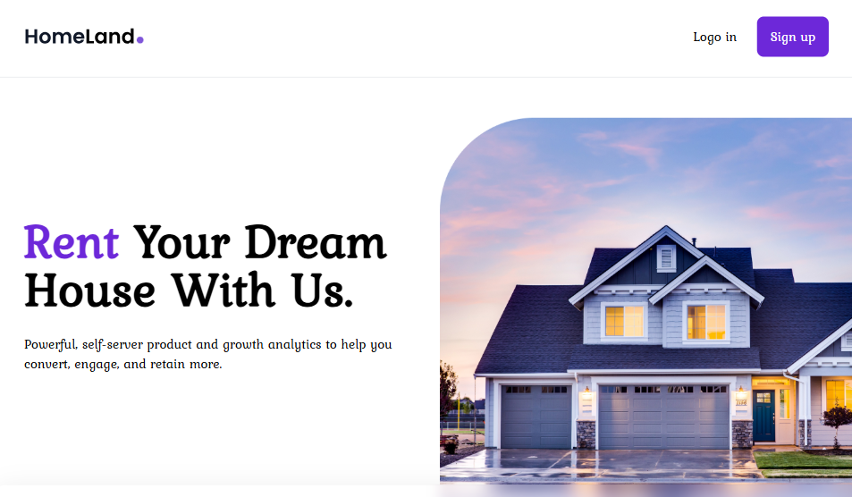

# 🏡 Sitio Web de Propiedades Inmobiliarias

Este proyecto es una aplicación web desarrollada con React + Vite que muestra una lista de casas en venta o alquiler con detalles como tipo, país, precio, habitaciones, baños y superficie. Cada propiedad se presenta en una tarjeta moderna y responsive.

## 🚀 Características

- Visualización de propiedades en formato de tarjetas.
- Íconos intuitivos para habitaciones, baños y superficie.
- Estilos atractivos usando Tailwind CSS.
- Componentes reutilizables con React.
- Animaciones de hover y diseño responsivo.
- Navegación con React Router.

## 🧰 Tecnologías utilizadas

- ⚛️ React
- ⚡ Vite
- 🎨 Tailwind CSS
- 🧭 React Router DOM
- 🧱 React Icons
- 🧩 Headless UI

## 📦 Scripts disponibles

En el directorio del proyecto puedes ejecutar:

```bash
npm install       # Instala las dependencias
npm run dev       # Inicia el servidor de desarrollo
npm run build     # Compila la aplicación para producción
npm run preview   # Previsualiza la build de producción
```

## 🧰 Vista Previa


